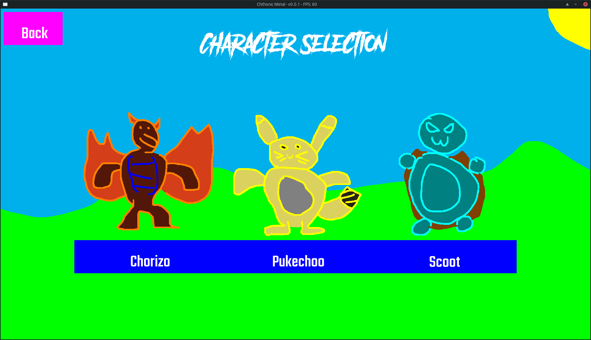
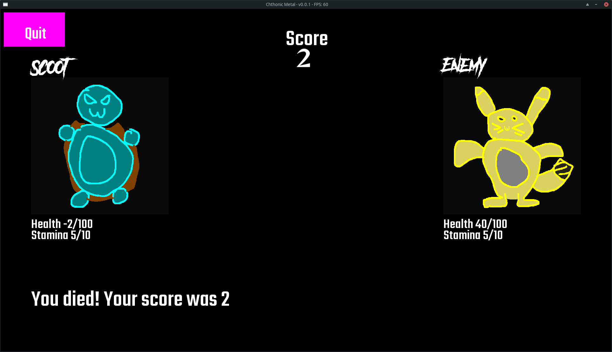
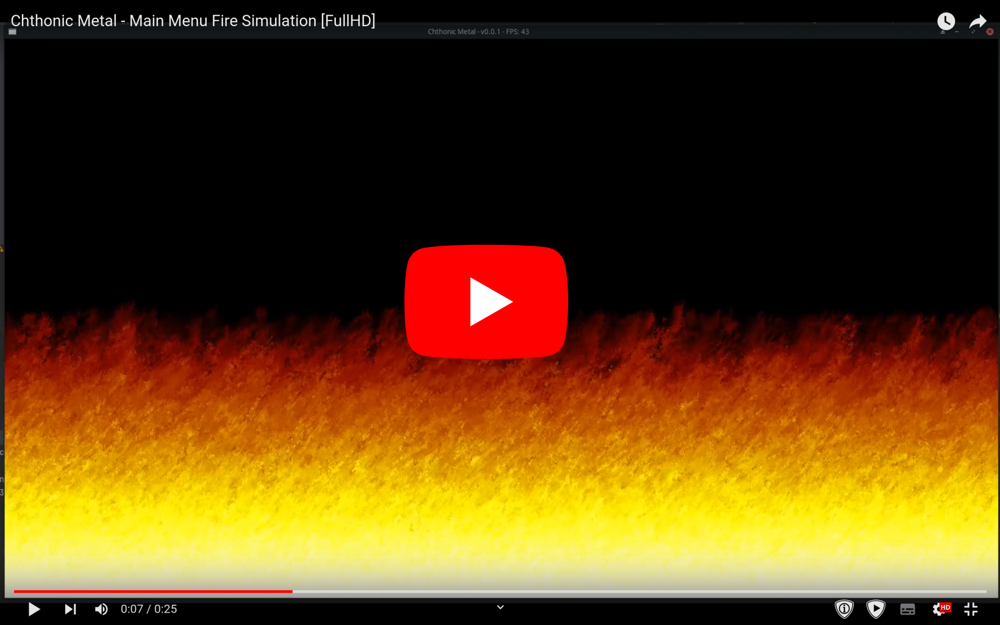

# Chthonic Metal
A very basic turn-based fighting game in SFML, made for my school's C++ course.
#### Final grade: 9.5/10 :D

A video of _just_ the fire simulation in 1080p 60fps: https://youtu.be/XLDmHoZUPjM

## Used libraries and their versions:
- SFML `sfml-2.5.1-3` (installed with system package manager, so it can't be included in the source code here)
- csv2 [permalink to used version](https://github.com/p-ranav/csv2/blob/a6d77394f308e02443c5501064ea8248471f6d41/single_include/csv2/csv2.hpp)

## Special thanks
- The main menu fire: https://fabiensanglard.net/doom_fire_psx/ and https://www.youtube.com/watch?v=6hE5sEh0pwI
- My friends for assisting with some things here and there :D
